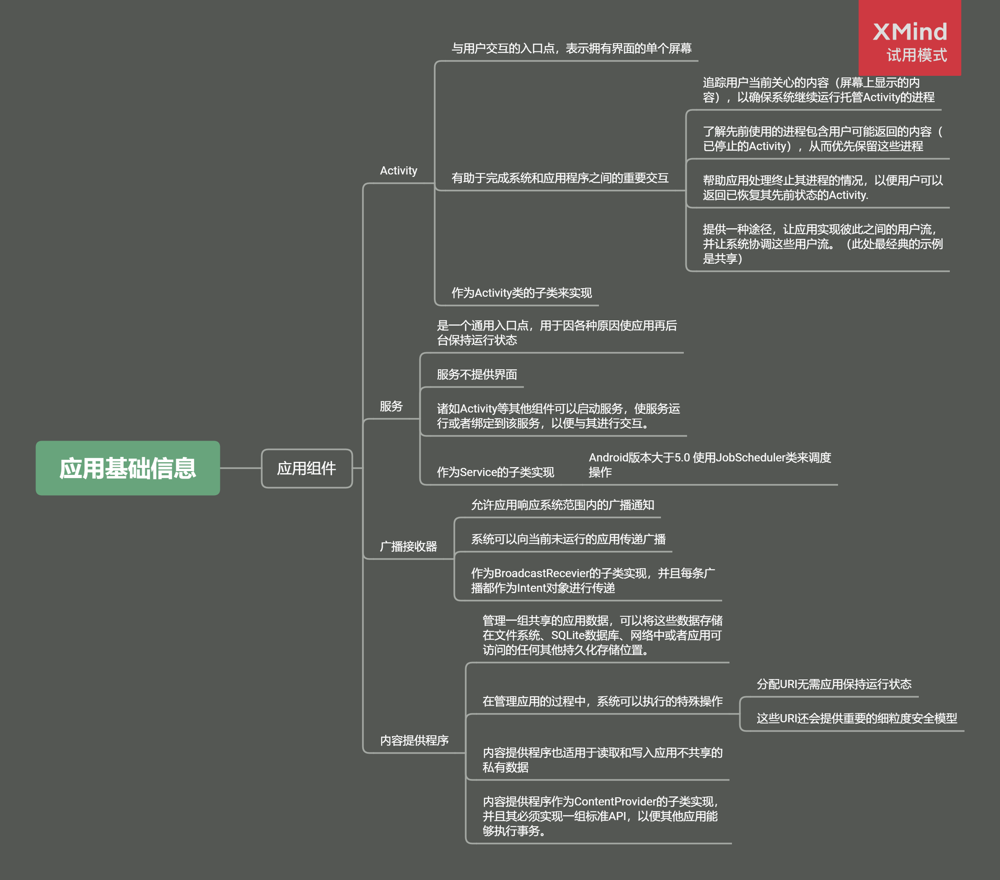

# Activity

<meta http-equiv="refresh">

## 生命周期

- onCreate：定义用户界面的布局，创建视图、绑定数据
    -  `savedInstanceState`, which is a Bundle object containing the activity's previously saved state. 
- onStart：将 Activity 显示在前台、跟用户交互前的最后准备，对用户可见
- onResume：与用户交互
- onPause：与用户无交互，有页面显示，无交互动作
- onStop：对用户不可见，屏幕被别的 Activity 占用
- onRestart：重新获得屏幕，并且已从 `onStop`状态结束的地方（保存当时的数据等）重新开始
- onDestory：生命周期的最后一个阶段，确保所有的资源已被释放

## Activty 状态状态变更

当配置发生更改时，Activity 会被销毁并重新创建。原始 Activity 实例将触发 onPause()、onStop() 和 onDestroy() 回调。系统将创建新的 Activity 实例，并触发 onCreate()、onStart() 和 onResume() 回调。

结合使用 ViewModels、onSaveInstanceState() 方法和/或持久性本地存储，可使 Activity 的界面状态在配置发生更改后保持不变

如果 Activity 位于前台，并且用户点按了返回按钮，Activity 将依次经历 onPause()、onStop() 和 onDestroy() 回调。活动不仅会被销毁，还会从返回堆栈中移除。需要注意的是，在这种情况下，默认不会触发 onSaveInstanceState() 回调。此行为基于的假设是，用户点按返回按钮时不期望返回 Activity 的同一实例。

## 测试 Activity

- 需要测试的场景
    + 其他应用（如设备的电话应用）中断了您应用的 Activity。
    + 系统销毁又重新创建了您的 Activity。
    + 用户将您的 Activity 放置在新的窗口环境中，例如画中画 (PIP) 或采用多窗口模式的环境

## 保存界面状态

用于保留界面状态的选项：

|比较项|ViewModle|onSaveInstanceState(已保存实例状态)|持久性存储空间|
|---|---|---|---|
|存储位置|在内存中|已序列化到磁盘|在磁盘或网络中|
|在配置更改后继续存在|是|是|是|
|在系统发起终止进程后继续存在|否|是|是|
|在用户完成 Activity 关闭/ onFinish() 后继续存在| 否| 否| 是|
|数据限制| 支持复杂对象，但空间可受内存的限制| 仅使用与基元类型和简单的小对象，例如字符串| 仅受限于磁盘空间或从网络资源检索的成本/时间|
|读取/写入时间|快（仅限内存访问）|慢（需要序列化/反序列化和磁盘访问）|需要磁盘访问或网络事务|
|保存数据类型|在内存中存储显示关联界面控制器所需的所有数据 示例：最近搜索的歌曲对象和最近的搜索查询| 存储当系统停止后又重新创建界面控制器时轻松重新加载 Activity 状态所需的少量数据。这里指的是将复杂的对象保留在本地存储空间中，并将这些对象的唯一 ID 存储在 onSaveInstanceState() 中，而不是存储复杂的对象 示例：存储最近的搜索查询。|存储在您打开和关闭 Activity 时不希望丢失的所有数据 示例：歌曲对象的集合，其中可能包括音频文件和元数据|

### ViewModle
ViewModel 非常适合在用户正活跃地使用应用时存储和管理界面相关数据。它支持快速访问界面数据，并且有助于避免在发生旋转、窗口大小调整和其他常见的配置变更后从网络或磁盘中重新获取数据。

与已保存实例状态不同，ViewModel 在系统发起的进程终止过程中会被销毁。因此，您应将 ViewModel 对象与 onSaveInstanceState() （或其他一些磁盘持久性功能） 结合使用，并将标识符存储在 savedInstanceState 中，以帮助视图模型在系统终止后重新加载数据。

### onSaveInstanceState()
onSaveInstanceState() 回调会存储一些数据，如果系统销毁后又重新创建界面控制器（如 Activity 或 Fragment），则需要使用这些数据重新加载该控制器的状态。

- 不建议使用 onSaveInstanceState() 的场景
    - 储大量的数据（如位图）
    - 存储需要冗长的序列化或反序列化操作的复杂数据结构
    - 在 Activity 启动时，如果一段界面状态数据（例如搜索查询）作为 intent extra 传入，则您可以使用 extra 捆绑包而不是 onSaveInstanceState() 捆绑包

#### 使用 SavedStateRegistry 接入已保存状态
SavedStateRegistry 允许组件连接到界面控制器的已保存状态，以使用后者或向其提供内容。
对已保存状态提供内容的组件必须实现 SavedStateRegistry.SavedStateProvider，后者定义了一个名为 saveState() 的方法。saveState() 方法允许组件返回 Bundle，其中包含应从该组件保存的任何状态。

SavedStateRegistry 将数据存储在与 onSaveInstanceState() 相同的 Bundle 中，因此需要遵守相同的考虑因素和数据限制。

### 针对复杂或大型数据使用本地持久性存储来处理进程终止
这种持久性本地存储空间通常已经是应用架构的一部分，用于存储您打开和关闭 Activity 时不想丢失的所有数据。

ViewModel和已保存实例状态均不是长期存储解决方案，因此不能替代本地存储空间，例如数据库。

