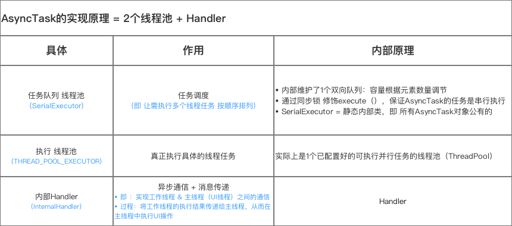
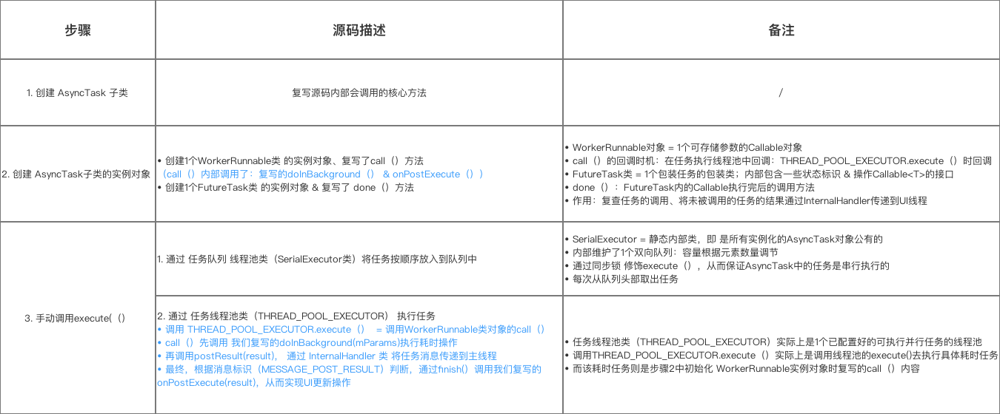

# AsyncTask

>[来源](https://www.jianshu.com/p/ee1342fcf5e7)

## 使用

### 前言
多线程的应用在 Android 开发中是非常常见的，常见的方法主要有：
- 继承 Thread 类
- 实现 Runnable 接口
- Handler
- AsyncTask
- HandlerThread

### 1. 定义
一个 Android 已封装好的轻量级异步类。属于抽象类，即：使用时需要实现子类。

### 2. 作用
1. 实现多线程：在工作线程中执行任务，如：耗时任务
2. 异步通信、消息传递：实现 工作线程 & 主线程（UI 线程）之间的通信。即：将工作线程的执行结果传递给主线程，从而在主线程中执行相关的 UI 操作，以保证线程安全。

### 3. 优点
1. 方便实现异步通信  
不需要使用“任务线程（如继承 Thread 类）+ Handler”的复杂组合
2. 节约资源  
采用线程池的缓存线程 + 复用线程，避免了频繁创建 & 销毁线程所带来的系统资源开销

### 4. 类 & 方法介绍
#### 4.1 类定义
AsyncTask 类属于抽象类，即使用时需要实现子类
```java
public abstract class AsyncTask<Params, Progress, Result> {
	·····
	/*
	* 类中参数为3种泛型
	* 整体作用：控制 AsyncTask 子类执行线程任务时各个阶段的返回类型
	* 具体说明：
	*				Params：开始异步任务时传入的参数类型，对应 execute() 种传递的参数
	*				Progress：异步任务执行过程中，返回任务进度值的类型
	*				Result：异步任务执行完成后，返回的结果类型，与 doInBackground() 的返回值类型保持一致
	* 注意事项：
	* 			1. 使用时并不是所有的类型都被使用
	*				2. 若无被使用，可用 Java.long.Void 类型代替
	*				3. 若有不同业务，需要额外再写一个 AsyncTask 的子类
	*/
}
```

#### 4.2 核心方法

| 核心方法 | 作用 | 调用时刻 | 备注 | 
| :---: | :--- | :--- | :--- | 
| execute() | 触发执行异步线程任务 | 手动调用 | 必须在UI线程中调用 </br> 运行在主线程
| onPreExecute() | 执行线程任务钱的操作 | 执行任务前自动调用</br>即执行 execute() 前自动调用</br><font color = red>不能手动调用，需让系统自动调用</font> | 用于界面的初始化操作，如 显示进度条的对话框 | 
| doInBackground() | 接收输入参数</br> 执行任务中的耗时操作 </br> 返回线程任务执行的结果 </br><font color = red>必须重写，从而自定义线程任务</font> | 执行线程任务时自动调用</br><font color = red>不能手动调用，需让系统自动调用</font> | 不能更改UI组件的新鲜，执行任务过程中可调用 publishProgress()更新进度信息 |
| onProgressUpdate() | 在主线程显示线程任务执行的进度 | 调用 publishProgress(Progress... values) 时自动调用</br><font color = red>不能手动调用，需让系统自动调用</font> | /|
| onPostExecute() | 接收任务执行结果；将执行结果显示到 UI 组件  </br><font color = red>必须重写，从而自定义 UI 操作</font> | 线程结束时自动调用 | / | 
|onCancelled() | 将异步任务设置为：取消状态（并不是真正的取消任务）| 异步任务被取消时自动调用 （需要在 doInBackground(）中判断终止任务| 该任务被调用时，onPostExecute() 就不会被调用|

### 5. 使用步骤

1. 创建 `AsyncTask` 子类 & 根据需求实现核心方法
2. 创建 `AsyncTask` 子类的实例对象（即任务实例）
3. 手动调用 `execute()`从而执行异步线程任务

示例代码：
```java
/**
  * 步骤1：创建AsyncTask子类
  * 注： 
  *   a. 继承AsyncTask类
  *   b. 为3个泛型参数指定类型；若不使用，可用java.lang.Void类型代替
  *   c. 根据需求，在AsyncTask子类内实现核心方法
  */

  private class MyTask extends AsyncTask<Params, Progress, Result> {

        ....

      // 方法1：onPreExecute（）
      // 作用：执行 线程任务前的操作
      // 注：根据需求复写
      @Override
      protected void onPreExecute() {
           ...
        }

      // 方法2：doInBackground（）
      // 作用：接收输入参数、执行任务中的耗时操作、返回 线程任务执行的结果
      // 注：必须复写，从而自定义线程任务
      @Override
      protected String doInBackground(String... params) {

            ...// 自定义的线程任务

            // 可调用publishProgress（）显示进度, 之后将执行onProgressUpdate（）
             publishProgress(count);
              
         }

      // 方法3：onProgressUpdate（）
      // 作用：在主线程 显示线程任务执行的进度
      // 注：根据需求复写
      @Override
      protected void onProgressUpdate(Integer... progresses) {
            ...

        }

      // 方法4：onPostExecute（）
      // 作用：接收线程任务执行结果、将执行结果显示到UI组件
      // 注：必须复写，从而自定义UI操作
      @Override
      protected void onPostExecute(String result) {

         ...// UI操作

        }

      // 方法5：onCancelled()
      // 作用：将异步任务设置为：取消状态
      @Override
        protected void onCancelled() {
        ...
        }
  }

/**
  * 步骤2：创建AsyncTask子类的实例对象（即 任务实例）
  * 注：AsyncTask子类的实例必须在UI线程中创建
  */
  MyTask mTask = new MyTask();

/**
  * 步骤3：手动调用execute(Params... params) 从而执行异步线程任务
  * 注：
  *    a. 必须在UI线程中调用
  *    b. 同一个AsyncTask实例对象只能执行1次，若执行第2次将会抛出异常
  *    c. 执行任务中，系统会自动调用AsyncTask的一系列方法：onPreExecute() 、doInBackground()、onProgressUpdate() 、onPostExecute() 
  *    d. 不能手动调用上述方法
  */
  mTask.execute()；

```
## 源码解析
[来源](https://www.jianshu.com/p/37502bbbb25a)

分析源码根据使用进行分析：
1. `AsyncTask()` 构造函数
2. `execute()` 执行方法

分析总结

