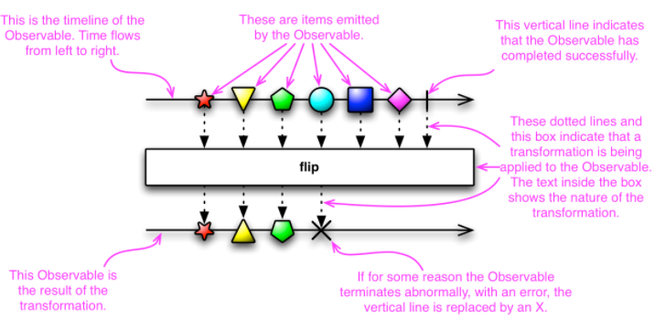

# RxJava-学习笔记

## Terminology--术语
- data flow
    + `source.operator1().operator2().operator3().subscribe(consumer)`
    + `source.flatMap(value -> source.operator1().operator2().operator3())`
- Backpressure
    + 含义： 一种流量控制策略，控制数据流处理过程中的内存使用，避免内存过多而造成的困境
    + 使用 Backpressure 的类： `Flowable`
- Assembly time: 执行所有 operation 的阶段
    + 该状态内，数据还没开始流动
- Subscription time: 调用`subscribe()`之后的一个临时状态，
    + 在该状态内，建立处理步骤链
    + 触发`subscription side-effects `
- Runtime: 数据流主动触发`item`、`errors`、`completion`信号

## RxJava 的用法
- 在后台线程进行计算、网络请求，将结果（或 error）显示在 UI 线程。

## Observable

- ReactiveX 的机制： `an observer subscribes to an Observable`
    - 流程
        + Observable(顾客) 产生需求(item)
        + subscribes(服务员) 观察到需求(item) 的产生，立即通知 Observer(厨师) 
        + Observer(厨师) 处理需求(item)
    - Observer 处理 items 是同步的（而不是按照 Observable 产生 items 的顺序依次处理），因此处理顺序是 *随机的*，当 items 处理完之后才返回结果
    - 优点
        + 当需要处理的 items 之间没有依赖关系，处理所有 item 所花费的时间，只是处理其中一个 item 最长的时间
    - Observable 产生事件或发起通知，是通过调用 Observer 的方法
        + `onNext()`
        + `onError()`
        + `onCompleted()`
