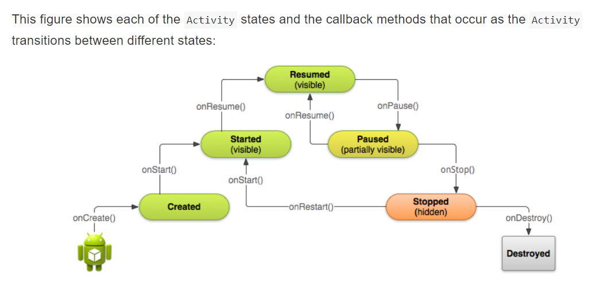

# Activities and intents

The one required callback your app must implement is the `onCreate()` method. The system calls this method when it creates your `Activity`, and all the essential components of your `Activity` should be initialized here. Most importantly, the `onCreate()` method calls `setContentView()` to create the primary layout for the `Activity`.

When the `setContentView()` method is called with the path to a layout file, the system creates all the initial views from the specified layout and adds them to your `Activity`. This is often referred to as <i>inflating</i> the layout.

inflating: 将 view 组件从 xml 布局文件内提出来的过程。(自己的理解)

You may often also want to implement the `onPause()` method in your `Activity`. The system calls this method as the first indication that the user is leaving your Activity (though it does not always mean that the `Activity` is being destroyed). <b>This is usually where you should commit any changes that should be persisted beyond the current user session</b> (because the user might not come back).

You can also create new `View` elements directly in your activity code by inserting new `View` objects into a `ViewGroup`, and then passing the root `ViewGroup` to `setContentView()`. After your layout has been inflated—regardless of its source—you can add more `View` elements anywhere in the `View` hierarchy.

Each activity is started or activated with an `Intent`, which is a message object that makes a request to the Android runtime to start an activity or other app component in your app or in some otherapp.


Use the `setData()` method with a Uri object to add that URI to the `Intent`. Keep in mind that the data field can only contain a single URI; if you call `setData()` multiple times only the last value is used. Use `Intent` extras to include additional information (including URIs.)
Some examples of using `setData()` with URIs:
```
// A web page URL
messageIntent.setData(Uri.parse("http://www.google.com")); 
// a Sample file URI
messageIntent.setData(Uri.fromFile(new File("/sdcard/sample.jpg")));
// A sample content: URI for your app's data model
messageIntent.setData(Uri.parse("content://mysample.provider/data")); 
// Custom URI 
messageIntent.setData(Uri.parse("custom:" + dataID + buttonId));
```

- Starting an Activity with an explicit Intent
	```
	Intent messageIntent = new Intent(this, ShowMessageActivity.class);
	startActivity(messageIntent);
	```
	+ The intent constructor takes two arguments for an explicit Intent:
		+ An application context. In this example, the Activity class provides the context (this).
		+ The specific component to start (ShowMessageActivity.class).
		
To launch a new Activity and get a result back, do the following steps in your originating Activity:

1. Instead of launching the Activity with startActivity(), call startActivityForResult() with the Intent and a request code.
2. Create a new Intent in the launched Activity and add the return data to that Intent.
3. Implement onActivityResult() in the originating Activity to process the returned data.


- Getting data back from an Activity
	- 流程：
		+ Activity_A: `startActivityForResult(messageIntent, TEXT_REQUEST);`
		+ Activity_B: 
		```
		messageIntent.putExtra(EXTRA_RETURN_MESSAGE, mMessage);
		setResult(RESULT_OK,replyIntent);
		finish(); // to close the Activity and resume the originating Activity(Activity_A):
		````
			- The response codes are defined by the Activity class, and can be
				- __RESULT_OK__: The request was successful.
				- __RESULT_CANCELED__: The user canceled the operation.
				- __RESULT_FIRST_USER__: For defining your own result codes.
				
		+ Activity_A: implement the `onActivityResult()` callback method. 
		```
		public void onActivityResult(int requestCode, int resultCode,  Intent data) {
		    super.onActivityResult(requestCode, resultCode, data);
		    if (requestCode == TEXT_REQUEST) {
		        if (resultCode == RESULT_OK) {
		            String reply = 
		               data.getStringExtra(SecondActivity.EXTRA_RETURN_MESSAGE);
		               // process data
		        }
		    }
		}
		```

- notions
	+ The __back stack__ is the set of each Activity that the user has visited and that can be returned to by the user with the back button
	+  A __task__ is an organizing concept for each Activity the user interacts with when performing an operation, whether they are inside your app or across multiple apps.
	+ `Bundle` object (a collection of key/value pairs)

## Activity lifecycle and state
[codelabs](http://clmirror.storage.googleapis.com/codelabs/android-training-activity-lifecycle-and-state/index.html#0)



- The paused state can occur in several situations:
	- The `Activity` is going into the background, but has not yet been fully stopped. This is the first indication that the user is leaving your `Activity`.
	- The `Activity` is only partially visible on the screen, because a dialog or other transparent `Activity` is overlaid on top of it.
	- In multi-window or split screen mode (API 24), the `Activity` is displayed on the screen, but some other `Activity` has the user focus.

-  This `onDestroy()` can happen in several cases:
	- You call finish() in your Activity to manually shut it down.
	- The user navigates back to the previous Activity.
	- The device is in a low memory situation where the system reclaims any stopped Activity to free more resources.
	- A device configuration change occurs.

Note that the system will save the state of some `View` elements, such as the contents of the `EditText`.


## Implicit intents
[codelabs](http://clmirror.storage.googleapis.com/codelabs/android-training-activity-with-implicit-intent/index.html#0)

If more than one activity matches the intent, the user is presented with an app chooser and picks which app they would like to perform the task.

Starting an Activity with an implicit Intent, and passing data from one Activity to another, works much the same way as it does for an explicit Intent:

1. In the sending Activity, create a new Intent object.
2. Add information about the request to the Intent object, such as data or extras.
3. Send the Intent with startActivity() (to just start the Activity) or startActivityforResult() (to start the Activity and expect a result back).

- When you create an implicit Intent object, you:

	+ Do not specify the specific Activity or other component to launch.
	+ Add an Intent action or Intent categories (or both).
	+ Resolve the Intent with the system before calling startActivity() or startActivityforResult().
		```
		if (sendIntent.resolveActivity(getPackageManager()) != null) {
		    startActivity(chooser);
		}
		```
	+ Show an app chooser for the request (optional).

例子：
```
// The implicit Intent object
Intent sendIntent = new Intent(Intent.ACTION_SEND);
// Always use string resources for UI text.
String title = getResources().getString(R.string.chooser_title);
// Create the wrapper intent to show the chooser dialog.
Intent chooser = Intent.createChooser(sendIntent, title);
// Resolve the intent before starting the activity
if (sendIntent.resolveActivity(getPackageManager()) != null) {
    startActivity(chooser);
}
```

 Only the main activity for your app should have this Intent filter.

 - Sharing data using ShareCompat.IntentBuilder
 
 With the ShareCompat.IntentBuilder class you do not need to create or send an implicit Intent for the share action. Use the methods in ShareCompat.IntentBuilder to indicate the data you want to share as well as any additional information. Start with the from() method to create a new Intent builder, add other methods to add more data, and end with the `startChooser()` method to create and send the Intent. You can chain the methods together like this:

 ```
 ShareCompat.IntentBuilder
    .from(this)         // information about the calling activity
    .setType(mimeType)  // mime type for the data
    .setChooserTitle("Share this text with: ") //title for the app chooser
    .setText(txt)       // intent data
    .startChooser();    // send the intent
 ```

 There are four launch modes available as part of the `<activity>` element:

- "__standard__" (the default): A new `Activity` is launched and added to the back stack for the current task. An `Activity` can be instantiated multiple times, a single task can have multiple instances of the same `Activity`, and multiple instances can belong to different tasks.
- "__singleTop__": If an instance of an `Activity` exists at the top of the back stack for the current task and an Intent request for that `Activity` arrives, Android routes that Intent to the existing `Activity` instance rather than creating a new instance. A new `Activity` is still instantiated if there is an existing `Activity` anywhere in the back stack other than the top.
- "__singleTask__": When the `Activity` is launched the system creates a new task for that `Activity`. If another task already exists with an instance of that `Activity`, the system routes the Intent to that `Activity` instead.
- "__singleInstance__": Same as single task, except that the system doesn't launch any other `Activity` into the task holding the `Activity` instance. The `Activity` is always the single and only member of its task.

