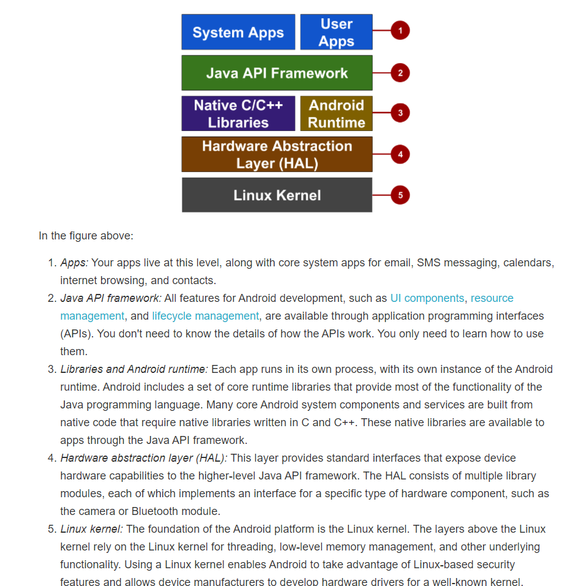
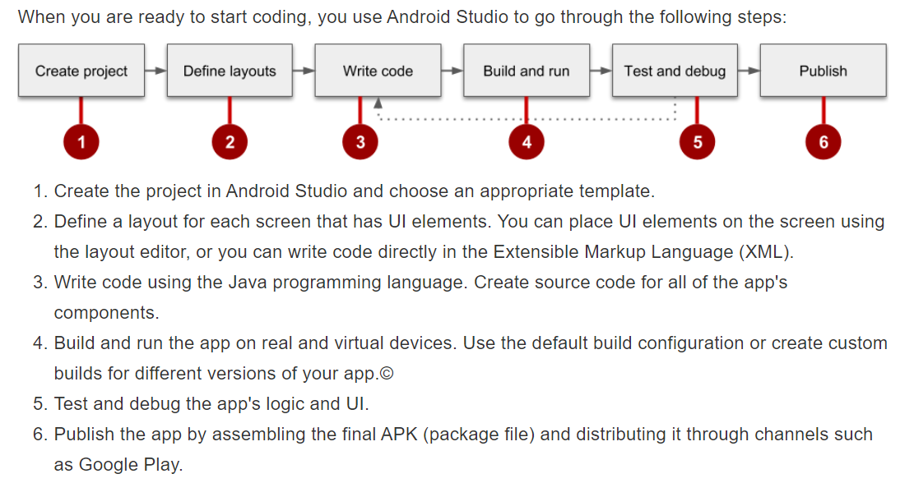
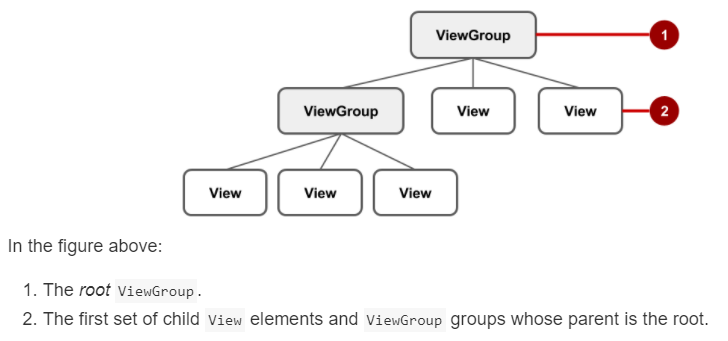
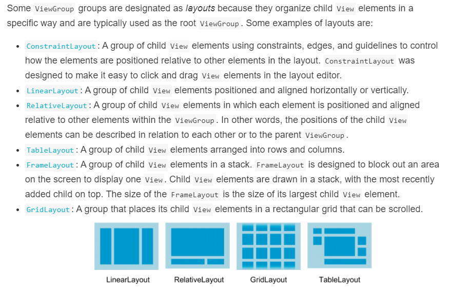

# Introduction

The SDK includes software libraries of prewritten code, a debugger, a device emulator, documentation, sample code, and tutorials. 



An app's performance is determined by how fast it runs, how easily it connects to the network, and how well it manages battery and memory usage. 



- notions:
	- Android application package (APK)
	- Android Virtual Device (AVD) 
	- density-independent pixels (dp)


build:grade(Project:apptitle): 不应该添加 app 依赖

`defaultConfig { }` 里面的配置会覆盖 `AndroidManifest.xml` 文件内的配置: The minSdkVersion and targetSdkVersion settings override any AndroidManifest.xml settings for the minimum SDK version and the target SDK version. 

- subView:
	- `TextView` for displaying text
	- `EditText` to enable the user to enter and edit text
	- `Button` and other clickable elements (such as `RadioButton`, `CheckBox`, and `Spinner`) to provide interactive behavior
	- `ScrollView` and `RecyclerView` to display scrollable items
	- `ImageView` for displaying images
	- `ConstraintLayout` and `LinearLayout` for containing other views and positioning them
	

- `ViewGroup` groups
	+ `ConstraintLayout`: A group that places UI elements (child `View` elements) using constraint connections to other elements and to the layout edges (parent `View`).
	+ `ScrollView`: A group that contains one other child `View` element and enables scrolling the child `View` element.
	+ `RecyclerView`: A group that contains a list of other `View` elements or `ViewGroup` groups and enables scrolling them by adding and removing `View` elements dynamically from the screen.
	




the @ symbol specifies what kind of resource. For example:
```
	android:background="@color/myBackgroundColor"
```

- LinearLayout is required to have these attributes set:
	- android:layout_width  
	- android:layout_height  
	- android:orientation  