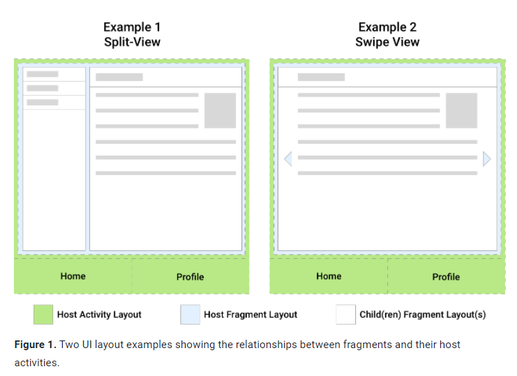

# Fragment

## Create

- Environment
    ```
    // Groovy
    dependencies {
    def fragment_version = "1.3.6"

    // Java language implementation
    implementation "androidx.fragment:fragment:$fragment_version"
    // Kotlin
    implementation "androidx.fragment:fragment-ktx:$fragment_version"
}
    ```


## FragmentManager
> FragmentManager 负责执行 fragment 的操作，包括 新增、移除、替换或者放在后台栈中

### 获取 FragmentManager

- 通过 Activity 获取
    + `getSupportFragmentManager()`
- 通过 Fragment 获取
    + `getChildFFragmentManager()`  管理子Fragment(fragment's children)
    + `getParentFragmentManager()`  管理主Fragment
    
