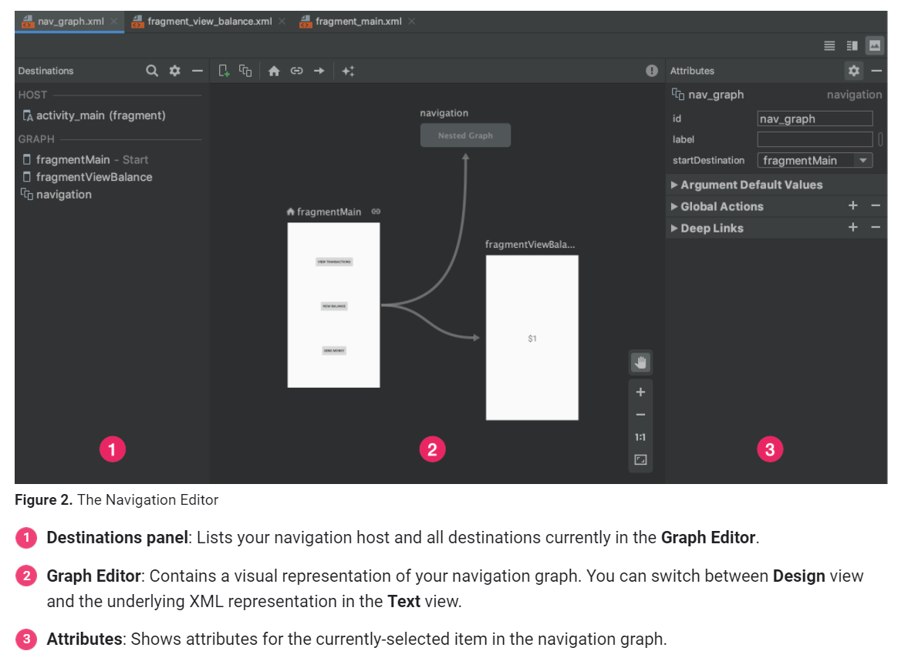

# Navigation 导航

## Overview

### 导航的原则

- Fixed start destination 固定起点
- Navigation state is represented as a stack of destinations 导航状态存储在栈内
- Up and Back are identical with your app's task 原生返回键和app自带返回键作用是一样的
- The Up button never exits you app 自带返回键不会退出app
- Deep linking simulates manual navigation 直接链接访问具体页面，与人工点击进入具体页面是一样的


### 导航组件
- 导航组件的重要组成部分
    + Navigation graph 导航图
        * 一个 xml 资源文件，在集中的位置包含所有导航相关信息(所有的目的地+actions)
    + `NavHost`
        * 显示导航图的容器
        * 默认实现：`NaviHostFragment` 显示 fragment 的目的地
    + `NaviController`
        * 当用户在 APP 内移动时，在 `NavHost` 内编排目的地的切换内容

- 导航组件的好处
    + Handling fragment transactions 处理 fragment 事件
    + Handling Up and Back actions correctly by default 
    + Providing standardized resources for animations and transitions
    + Implementing and handling deep linking
    + Including Navigation UI patterns, such as navigation drawers and bottom navigation, with minimal additional work
    + Safe Args - a Gradle plugin that provides type safety when navigating and passing data between destinations
    + `ViewModel` support - you can scope a `ViewModel` to a navigation graph to share UI-related data between the graph's destinations

### Get started

- 配置环境
```kotlin
dependencies {
  val nav_version = "2.3.5"

  // Java language implementation
  implementation("androidx.navigation:navigation-fragment:$nav_version")
  implementation("androidx.navigation:navigation-ui:$nav_version")

  // Kotlin
  implementation("androidx.navigation:navigation-fragment-ktx:$nav_version")
  implementation("androidx.navigation:navigation-ui-ktx:$nav_version")

  // Feature module Support
  implementation("androidx.navigation:navigation-dynamic-features-fragment:$nav_version")

  // Testing Navigation
  androidTestImplementation("androidx.navigation:navigation-testing:$nav_version")

  // Jetpack Compose Integration
  implementation("androidx.navigation:navigation-compose:2.4.0-alpha08")
}
```

- 创建导航图
    + 元素
        * Destinations: the different content areas in app
        * Actions: the logical connections between destinations that represent paths that user can take
    + 创建
        * In the Project window, right-click on the `res` directory and select `New > Android Resource File`. The New Resource File dialog appears.
        * Type a name in the `File name` field, such as "nav_graph".
        * Select `Navigation` from the `Resource type` drop-down list, and then click `OK`.
    + AS 导航图窗口
    

