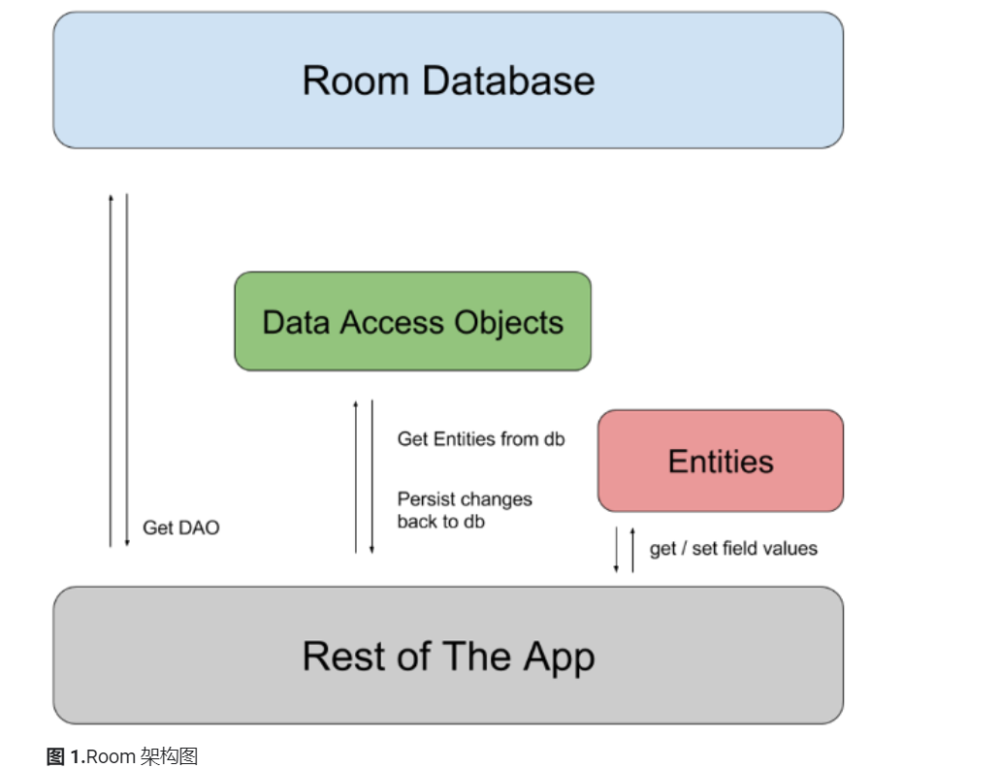

# 将数据保存到本地数据库 —— Room
[TOC]

## 概览
> Room 在 SQLite 上提供了一个抽象层，以便在充分利用 SQLite 的强大功能的同时，能够流畅地访问数据库



- Room 包含 3 个主要组件：
    - 数据库：包含数据库持有者，并作为应用已保留的持久关系型数据的底层连接的主要接入点。使用 @Database 注释的类应满足以下条件：
    > 在运行时，您可以通过调用 Room.databaseBuilder() 或 Room.inMemoryDatabaseBuilder() 获取 Database 的实例。
        - 是扩展 RoomDatabase 的抽象类。
        - 在注释中添加与数据库关联的实体列表。
        - 包含具有 0 个参数且返回使用 `@Dao` 注释的类的抽象方法。  
    - Entity：表示数据库中的表。
    - DAO：包含用于访问数据库的方法。

## 使用 Room 实体定义数据
> 使用 Room 持久性库时，您可以将相关字段集定义为实体。对于每个实体，系统会在关联的 Database 对象中创建一个表，以存储这些项。
> sqlite不区分表名和列名的大小写。

- 定义实体示例：
```kotlin
    @Entity
    data class User(
        @PrimaryKey var id: Int,
        var firstName: String?,
        var lastName: String?
    )

```
- 默认情况下 Room 使用 类名作为数据库的表名，如果需要使用不一样的名称：在 Entity 注解内增加属性 tableName 
    - eg: `@Entity(tableName = "users")`
- 默认情况下，Room 使用属性名作为表的列名，如果需要修改列名，增加注解 ColumnInfo 并添加属性 name 
    - eg: `@ColumnInfo(name = "first_name") `

- 每一个实体必须定义一个主键，使用注解 PrimaryKey 标识
    - 复合主键：在注解Entity增加属性primaryKeys
        - eg：`@Entity(primaryKeys = arrayOf("firstName", "lastName"))`

- 不保存实体类中的属性作为数据库的列
    - 独立的实体类（父类）： 使用注解 Ignore
    - 子类： 在注解Entity内增加属性ignoredColumns
        - eg: `@Entity(ignoredColumns = arrayOf("picture"))` 

- 提供表查询支持
> If your app requires very quick access to database information through full-text search (FTS), have your entities backed by a virtual table that uses either the FTS3 or FTS4 SQLite extension module
    - 使用注解`Fts4`
    - 如果表支持多种语言，在注解`Fts4`内增加属性`languageId`表明该列为存储语言信息的列
    - 为表添加索引，以提高检索速度
        - 在`Entity`注解内，使用属性`indices`声明独立索引或联合索引
        - 保持属性的唯一性，在`Index`属性内，设置`unique`属性为`true`
            - eg:
            ```java
                @Entity(indices = {@Index(value = {"first_name", "last_name"},
                        unique = true)})
                public class User {
                    @PrimaryKey
                    public int id;

                    @ColumnInfo(name = "first_name")
                    public String firstName;

                    @ColumnInfo(name = "last_name")
                    public String lastName;

                    @Ignore
                    Bitmap picture;
                }
            ```

## 通过 DAO 获取数据
> Each DAO includes methods that offer abstract access to your app's database. At compile time, Room automatically generates implementations of the DAOs that you define.

- 可以将 DAO 定义为抽象类或接口（一般用接口）
- 两种与数据库进行交互的 DAO 方法
    - 不需要写任何 SQL 语句就可以进行增、删、改的简单方法
    - 需要写 SQL 语句的查询方法

### 简单方法
eg: 
    ```kotlin
        @Dao
        interface UserDao {
            @Insert(onConflict = OnConflictStrategy.REPLACE)
            fun insertUsers(vararg users: User)

            @Insert
            fun insertBothUsers(user1: User, user2: User)

            @Insert
            fun insertUsersAndFriends(user: User, friends: List<User>)
        } 
    ```

- Insert
    - 可以选择有返回值，返回插入的行ID，如果是插入多个值，返回的为行ID列表
- Update
    -  Room通过主键确认行数据，如果主键不存在，则不进行操作
    -  可以选择有返回值，返回更新成功的行数
- Delete
    - 与Update的笔记相同


### 需要自定义SQL语句的查询
> 包括查询和复杂的增、删、改方法
> Room在编译时才会验证SQL语句是否正确

- 简单查询
```
@Query("SELECT * FROM user")
public User[] loadAllUsers();
```
- 查询表中的部分列属性
```kotlin
data class NameTuple(
    @ColumnInfo(name = "first_name") val firstName: String?,
    @ColumnInfo(name = "last_name") val lastName: String?
)
@Query("SELECT first_name, last_name FROM user")
fun loadFullName(): List<NameTuple>
```
    - 创建新类用于接收表中的部分属性
    - 查询所需的部分属性
- 在查询时传入参数
```kotlin
@Query("SELECT * FROM user WHERE age > :minAge")
fun loadAllUsersOlderThan(minAge: Int): Array<User>
@Query("SELECT * FROM user WHERE age BETWEEN :minAge AND :maxAge")
fun loadAllUsersBetweenAges(minAge: Int, maxAge: Int): Array<User>

@Query("SELECT * FROM user WHERE first_name LIKE :search " +
       "OR last_name LIKE :search")
fun findUserWithName(search: String): List<User>
```
-  在查询时传递参数集（数量不定）
```kotlin
@Query("SELECT * FROM user WHERE region IN (:regions)")
fun loadUsersFromRegions(regions: List<String>): List<User>
```
    - 传递的参数是在运行时才能获取
- 从多个表中查询数据
```kotlin
interface UserBookDao {
    @Query(
        "SELECT user.name AS userName, book.name AS bookName " +
        "FROM user, book " +
        "WHERE user.id = book.user_id"
    )
    fun loadUserAndBookNames(): LiveData<List<UserBook>>

    // You can also define this class in a separate file.
    data class UserBook(val userName: String?, val bookName: String?)
}
```

### 特殊返回类型
- 使用分页库进行分页查询
```kotlin
@Dao
interface UserDao {
  @Query("SELECT * FROM users WHERE label LIKE :query")
  fun pagingSource(query: String): PagingSource<Int, User>
}
```
- 直接游标访问
```kotlin
@Dao
interface UserDao {
    @Query("SELECT * FROM user WHERE age > :minAge LIMIT 5")
    fun loadRawUsersOlderThan(minAge: Int): Cursor
}
```
