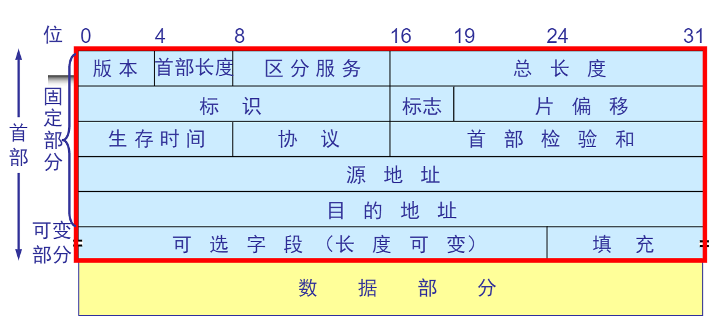

# 计算机网络(第5版)重点知识总结-笔记

[TOC]

## 概述

- 现在主要的三种网络
    + 电信网络
    + 有线电视网络
    + 计算机网络——信息时代的核心技术
- 带宽：网络可通过的最高数据率，单位 bit/s
- IP 网络的重要特点
    + 每一个分组独立选择路由
    + 发往同一个目的地的分组，后发送的有可能先收到(即可能不按顺序接收)
    + 当网络中的通信量过大时，路由器就来不及处理分组，于是要丢弃一些分组。因此，IP 网络不保证分组的可靠交付
    + IP 网络提供的服务被称为： 尽最大努力服务(Best Effort Service)
- 最重要的两个协议
    + IP 协议：控制分组在因特网的传输，但因特网不保证可靠交付
    + TCP 协议：保证了应用程序之间的可靠通信
- 网络中的核心部分是由许多网络和把它们连接起来的路由器组成，而主机处在因特网的边缘部分
    + 主机：进行信息处理和交换信息
    + 路由器：转发分组，这是网络核心部分最重要的功能
- 电路交换：面向连接
    + 三个阶段
        * 建立连接
        * 通信
        * 释放连接
- 计算机网络的性能指标
    + 速率
    + 带宽
    + 吞吐量
    + 时延
        * 传输时延：从结点发送帧到信道上的时间
        * 传播时延：帧在信道上的传播时间
        * 处理时延：交换结点存储转发时的处理时间
        * 排队时延：交换结点缓存排队时间
        * 总时延：以上四者之和
    + 时延带宽积
    + 利用率
        * 信道利用率
            - 信道利用率并非越高越好
        * 网络利用率：全网络的信道利用率的加权平均值
- 协议：控制两个对等实体进行通信的规则集合
    - 含义：为进行网络中的数据交换而建立的规则、标准或约定
    + 要素
        * 语法：数据与控制信息的结构或格式
        * 语义：需要发送何种控制信息，完成何种动作以及作出何种响应
        * 同步：事件实现顺序的详细说明

## 物理层
- 特性
    + 机械特性：指明接口所需接线器的形状和尺寸、引线数目和排列、固定和锁定装置
    + 电气特性：指明在接口电缆的各条线上出现的电压的范围
    + 功能特性：指明某条线上出现的某一电平的电压表示何种意义
    + 过程特性：指明对不同功能的各种可能事件的出现顺序
- 导向传输媒体
    + 双绞线
    + 同轴光缆
    + 光缆
    + 无线信道
- 信道复用技术
    + 频分复用
    + 时分复用
    + 波分复用
    + 码分复用
        * CDMA(码分多址)
            - 很强的抗干扰能力
            - 彼此不会造成干扰
            - 任何一个码片向量和自己的规格化内积都是 1
            - 一个码片向量和其反码的规格化内积都是 -1
            - 两个不同站的码片序列正交都是 0

## 数据链路层
- 使用的信道分类
    + 点对点信道：使用一对一的点对点通信方式
    + 广播信道：使用一对多的广播通信方式，过程较复杂
-   各传输层的数据单位
    + 网络层：IP 数据报（IP 分组)
    + 数据链路层：帧
    + 物理层：比特
- 数据链路层传输数据的三个基本问题
    + 封装成帧
    + 透明传输
        * 字节填充
        * 字符填充
            - 0x7E->(0X7D,0X5E)
            - 0X7D->(0X70,0X5D)
            - Byte<0x20->(0x7D,Byte)
    + 差错控制
        + CRC循环校验
- 点对点协议 PPP(Point-to-Point Protocol)
    + 应满足的要求
        * 简单
        * 封装成帧
        * 透明性
        * 多种网络层协议
        * 多种类型链路
        * 差错检测
            - 0 bit填充，发送时：5个连续1后的一个插入一个0
        * 检测连接状态
        * 最大传送单元
        * 网络层地址协商
        * 数据压缩协商
    + 不要的功能
        * 纠错(只需要检测有无错，不需要纠错)
        * 流量控制
        * 序号
        * 多点线路
        * 半双工或单工链路
    + 组成部分
        * 一个将 IP 封装到串行链路的方法
        * 链路控制协议 LCP(Link Control Protocol)
        * 网络控制协议 NCP(Network Control Protocol)
    + 不使用序号和确认机制

## 网络层
- 提供两种服务的对比

| 对比方面 | 虚电路服务 | 数据报服务 |
|---|---|---|
| 思路 | 可靠通信应当由网络来保证 | 可靠通信应当由用户主机来保证 |
| 连接的建立 | 必须有 | 不需要 |
| 终点地址 | 仅在连接建立阶段使用，每个分组使用短的虚电路号 | 每个分组都有终点的完整地址 |
| 分组的转发 | 同属于一条虚电路的分组均按照同一路由进行转发 | 每个分组独立选择路由进行转发 |
| 当结点发生故障时 | 所有通过故障的结点的虚电路均不能工作 | 出故障的结点可能会丢失分组，一些路由可能会发生变化 |
| 分组的顺序 | 总是按发送顺序到达终点 | 到达终点时不一定按发送顺序 |
| 端到端的差错处理和流量控制 | 可以由网络负责，也可以由用户主机负责 | 由用户主机负责 |

### IP 协议
- 配套使用的协议
    + 地址解析协议 ARP(Adress Resolution Protocol)
    + 逆地址解析协议 RARP(Reverse Adress Resolution Protocol)
    + 网际控制报文协议 ICMP(Internet Control Message Protocol)
    + 网际组管理协议 IGMP(Internet Group Management Protocol)
- 分类的 IP 地址
    + 组成： 网络号+主机号
        * 网络号：标志主机(或路由器)所连接到的网络
        * 主机号：标志该主机(或路由器)
    + 两级的 IP 地址：`IP 地址 ::= {<网络号>,<主机号>}`
    + 类别(分割线前为网络号，后为主机号)
        * A 类地址  `0-------|------------------------|`
        * B 类地址  `10--------------|----------------|`
        * C 类地址  `110---------------------|--------|`
        * D 类地址  `1110----------------------------|` 多播地址
        * E 类地址  `1111----------------------------|` 保留今后使用
- IP 地址表示方式
    + 二进制代码
    + 点分十进制：每8位转换为十进制数，并用`.`隔开；提高可读性
- IP 地址的使用范围

| 网络类别 | 最大网络数 | 第一个可用的网络号 | 最后一个可用的网络号 | 每个网络种最大的主机数 |
| --- | --- | --- | --- | --- |
| A | 126(2^7 - 2) | 1 | 126 | 16,777,214 |
| B | 16,383(2^14 - 1) | 128.1 | 192.255 | 65,534 |
| C | 2,097,151(2^21 - 1) | 192.0.1 | 223.255.255 | 254 |

- 特殊地址
    + 环回地址：IP 地址第一个字节为127，如`127.0.0.1`
    + 网络地址：主机号地址部分全为 0
    + 广播地址
        * 直接广播地址：主机号地址部分全为 1，用于向某个网络的所有主机广播
        * 有限广播地址：`255.255.255.255`，在未知本网地址情况下用于本网广播
- IP 地址的一些重要特点
    + 是一种分等级的地址结构
        * 方便 IP 地址的管理
        * 减小路由表所占的存储空间
    + 是标志一个主机(或路由器)和一条链路的接口
        * 当一个主机同时连接到两个网络上时，该主机必须同时具有两个相应的 IP 地址，这种主机称为多归属主机
        * 由于一个路由器至少应连接到两个网络，因此一个路由器至少应当有两个不同的 IP 地址
    + 用转发器或网桥连接起来的若干个局域网仍为一个网络，因此这些局域网都具有同样的网络号 net-id
    + 所有分配到网络号的网络，范围很小的局域网，还是可能覆盖很大地理范围的广域网，都是平等的
- ARP协议 和 RARP 协议 
    + 地址转换
        + IP 地址 --> ARP --> 物理地址
        + 物理地址 --> RARP --> IP地址
    + 应当注意的问题
        * ARP 是解决同一个局域网上的主机或路由器的 IP 地址和硬件地址的映射问题
        * 如果要找的主机和源主机不在同一个局域网上，那么就要通过ARP找到一个位于本局域网上的某个路由器的硬件地址，然后把分组发送给这个路由器，让这个路由器把分组转发给下一个网络。剩下的工作就由下一个网络来做
        * 从 IP 地址到硬件地址的解析是自动进行的，主机用户并不知情
- IP 数据报的格式：`首部+数据`
    + 首部 = 固定长度(20字节)+可变长度
    + 

### 划分子网和构造超网

- 划分子网
    + 从两级 IP 地址到三级 IP 地址
    + 划分子网纯属一个单位内部的事前，单位对外仍然表现为没有划分子网的网络
    + 从主机号借用若干个位作为子网号 subnet-id，而主机号 host-id 也就相应减少了若干位
    + `IP 地址 ::= {<网络号>,<子网号>,<主机号>}`
- 子网掩码
    + 从一个 IP 数据报的首部无法判断源主机或目的主机所连接的网络是否进行了子网划分
    + 使用子网掩码可以找出 IP 地址中的子网部分
    + `(IP 地址) AND (子网掩码) = 网络地址`
- 无分类编址 CIDR
    + 主要特点
        * 消除了传统 A/B/C 类地址以及划分子网的概念，因而可以更加有效地分配 IPv4的地址空间
        * 使用各种长度的“网络前缀”来代替分类地址中的网络号和子网号
        * IP 地址从三级编址又回到了二级编址
    + 最长前缀匹配
        * 网络前缀越长，其地址块越小，因而路由就越具体
        * 最长前缀匹配又称为最长匹配或最佳匹配

### 网际控制报文协议 ICMP
- ICMP 允许主机或路由器报告差错情况和提供有关异常情况的报告
- ICMP 报文作为 IP 层数据报的数据，加上数据报的首部，组成 IP 数据报发送出去

### 路由选择协议

#### 内部网关协议 IGP(Interior Gateway Protocol)
> 在一个自治系统内部使用的路由选择协议。  
> 目前这类路由选择协议使用得最多，如 RIP OSPF

- RIP
    + 工作原理
        * RIP 是一种分布式的基于 距离向量的路由选择协议
        * RIP 协议要求网络中的路由器都要维护从它自己到其他每一个目的网络的距离记录
    + 距离的定义
        * 从一路由器到直接连接的网络的距离定义为 1
        * 距离也称为跳数，每经过一个路由器，跳数就加 1
        * 距离 实际上指的是 最短距离
        * RIP 允许一条路径最多只能包含 15 个路由器
        * “距离”最大值为16时即相当于不可达
        *  RIP 只适用于小型互联网
        *  RIP 不能在两个网络之间同时使用多条路由
    + RIP 协议的三个要点
        * 仅和相邻路由器交换信息
        * 交换的信息是当前本路由器所知道的全部信息，即自己的路由表
        * 按固定的时间间隔交换路由信息
    + RIP 的收敛过程较快
    + RIP 的优缺点
        * 好消息传得快，坏消息传得慢
        * RIP 协议最大的优点就是实现简单，开销较小
        * RIP 限制了网络的规模，它能使用的最大距离为 15
        * 路由器之间交换的路由信息是路由器中的完整路由表，因而随着网络规模的扩大，开销也就增加
- OSPF
    + OSPF 的基本特点
        * 是分布式的链路状态协议
        * 开放 表明 OSPF 协议不是受某一家厂商控制的，而是公开发表的
        * 最短路径优先 是因为使用了 Dijkstra 提出的最短路径算法 SPF
        * OSPF 只是一个协议的名字，它并不表示其他的路由选择协议不是“最短路径优先”
    + 三个要点
        * 向本自治系统中的所有路由器发送信息，使用 洪泛法
        * 发送的信息就是与本路由器相邻的所有路由器的链路状态，但这知识路由器所知道的本分信息
            - 链路状态 就是说明本路由器都和哪些路由器相邻，以及该链路的“度量”(metric)
        * 只有当链路状态发生变化时，路由器才用洪泛法向所有路由器发送此信息

#### 外部网关协议 EGP(External Gateway Protocol)
> 若源站和目的站处在不同的自治系统中，当数据报传到一个自治系统的边界时，就需要使用一种协议将路由选择信息传递到另一个自治系统中。这样的协议就是外部网关协议 EGP。在外部网关协议中目前使用最多的是 BGP-4。

### 虚拟专用网 VPN 和网络地址转换 NAT
- 虚拟专用网
    + 本地地址：仅在机构内部使用的 IP 地址，可以由本机构自行分配，而不需要向因特网的管理机构申请
        * 专用地址
            - 10.0.0.0 -- 10.255.255.255
            - 172.16.0.0 -- 172.31.255.255
            - 192.168.0.0 -- 192.168.255.255 
    + 全球地址：全球唯一的IP地址，必须向因特网的管理机构申请

- 网络地址转换 NAT
    + 将转换本地专用地址和全球地址

## 运输层

## 安全
- 安全性威胁
    + 被动攻击：攻击者知识观察和分析，而不干扰信息流
        + 截获：从网络上窃听他人的通信内容
    + 主动攻击：对某个连接中通过的协议数据单元(PDU)进行各种处理
        * 中断：有意中断他人在网络上的通信
        * 篡改：故意篡改网络上传送的报文
        * 伪造：伪造信息在网络上传送

- 