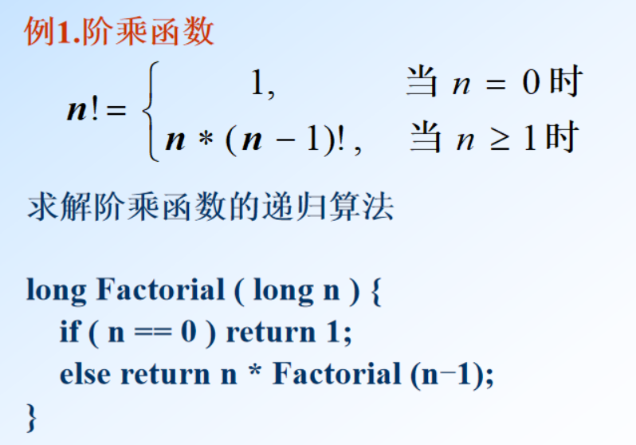
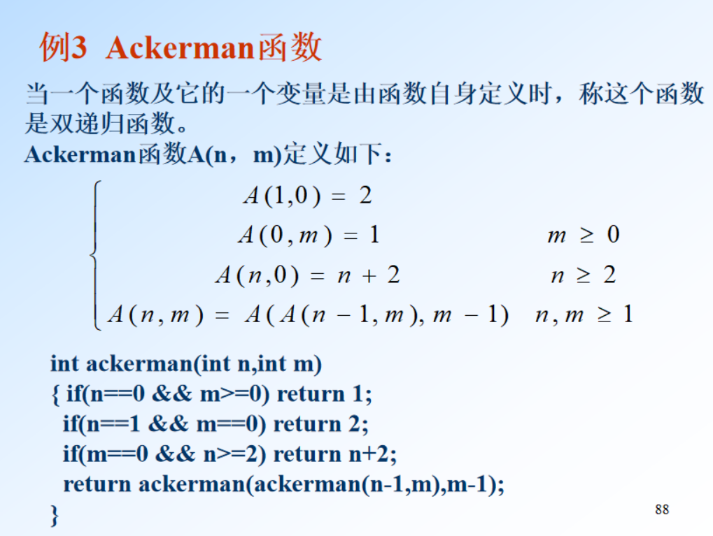

# 栈和队列

## 栈
- 定义： 是限定仅在表尾进行插入或者删除操作的线性表。
    + 允许插入的一端称为栈顶(top)，另一端称为栈底(bottom)
- 特点：后进先出(LIFO)

- 栈的表示和实现
    + 顺序栈：栈的顺序存储结构，利用一组地址连续的存储单元依次存放自栈底到栈顶的数据元素，指针top指向栈顶元素在顺序栈中的下一个位置，base为栈底指针，指向栈底的位置。
        * 判栈空：`S->top == S->base`
        * 判栈满：`S->top - S->base >= S->StackSize`
    + 链式栈：栈的链接表示
        * 特点：
            - 无栈满问题，空间可扩充
            - 插入与删除仅在栈顶处执行
            - 链式栈的栈顶在链头
        * 判栈空：`S->top == NULL`

### 栈的应用

- 数制转换
- 行编辑程序
- 迷宫求解
- *表达式求值*

## 队列
- 定义： 只允许在表的一端进行插入，而在另一端删除元素的线性表
    + 允许插入的一端叫队尾(rear)
    + 允许删除的一端称为队头(front)
- 特点：先进先出(FIFO)
- 队列的表示和实现
    - 链队列： 队列的链式表示
        - 在进队时，无队满问题，有队空问题
    - 顺序队列（队列的顺序存储表示）：用一组地址连续的存储单元依次存放从队列头到队尾的元素，指针front和rear分别指示队头元素和队尾元素的位置
        + 插入新的队尾元素：尾指针增1`rear +=1`
        + 删除队头元素：头指针增1`front+=1`
        + 在非空队列中，头指针始终指向队列头元素，而尾指针始终指向队列尾元素的下一个位置，队满时再进队将溢出
    - 循环队列：解决顺序队列的溢出问题
        + 队头、队尾指针加1，可用取模运算实现
        + 初始化：`front = rear=0`
        + 队空：`front == rear`
        + 队满：`(rear+1 ) % maxsize == front`
        + 删除队头元素：`front = (front+1)%maxsize`
        + 插入新的队尾元素：`rear = (rear+1)%maxsize`
    - 优先队列：每次从队列中取出的是具有最高优先权的元素

## 递归
- 定义：若一个对象部分地包含它自己,  或用它自己给自己定义,  则称这个对象是递归的；若一个过程直接地或间接地调用自己, 则称这个过程是递归的过程
- 三种递归情况
    + 定义是递归的
        * 阶乘函数
        
        * 斐波那契数列函数的定义
        * Ackerman函数
        
    + 数据结构是递归的
        * 单链表结构
    + 问题的解法是递归的
        * 汉诺塔问题的解法 
 
- 调用
    + 内部调用：递归过程每次递归调用自己
    + 外部调用：主程序第一次调用递归过程
- 递归工作栈：保存过程中使用的参数、局部变量返回地址等
- 递归过程改为非递归过程
    - 单向递归和尾递归可直接用迭代实现其非递归过程
    - 其他情形必须借助栈实现非递归过程
- 递归的优缺点
    + 优点
        * 简洁
        * 易编
        * 易懂
    + 缺点
        * 效率低
        * 重复计算多
