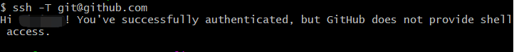

# git配置

## 一个Git客户端多个git账号
[参考文档-码云](https://gitee.com/help/articles/4229#article-header1)  
链接内的说明也已经很方便了，这里大部分只是重复一遍罢了。

### 背景
在公司电脑上安装了一套git应用，但有两个账号，想通过同一个git应用推送两个账号的代码。
1. 一个自己的GitHub账号，用于记录自己的活动
2. 一个公司的gitlab账号，用于提交公司开发代码

### 解决方法
1.在~/.ssh目录下新建文件夹company并生成一个公司的SSH-Key
```
$ mkdir company
$ ssh-keygen -t rsa -C 'xxxxx@company.com' -f ~/.ssh/company/company_id_rsa
```
2.在~/.ssh目录下新建文件夹github并生成一个GitHub的SSH-Key
```
$ mkdir github
$ ssh-keygen -t rsa -C 'xxxxx@qq.com' -f ~/.ssh/github/github_id_rsa
```
3.在~/.ssh目录下新建一个config文件（该文件为无后缀文件），添加如下内容：
```
# company
Host company.com  #Host和HostName填写git服务器的域名
HostName company.com
PreferredAuthentications publickey
IdentityFile ~/.ssh/company/gitee_id_rsa #指定私钥的路径
# github
Host github.com #Host和HostName填写git服务器的域名
HostName github.com
PreferredAuthentications publickey
IdentityFile ~/.ssh/github/github_id_rsa #指定私钥的路径
```
4.用ssh命令分别测试
```
$ ssh -T git@company.com
$ ssh -T git@github.com
```
以GitHub为例，成功的会话返回为：


## GitHub设置ssh key后push代码依旧需要输入用户名、密码
[参考博文-CSDN](https://blog.csdn.net/weixin_38515203/article/details/89426242)

## 分支管理

### 1. 撤销操作
- 重新提交
```
$ git commit --amend
```
- 取消暂存的文件
```
$ git reset HEAD <file>
```
- 撤销对文件的修改
```
$ git checkout -- <file>
```
- windows下git bash中文字符被转义，不能正常显示解决办法
```
$ git config --global core.quotepath false
```

### 2. 删除分支
- 删除远程分支
> git fetch -p origin //清除远程分支的本地缓存  
> git branch -a //查看远程分支  
> git push origin --delete ${branchName} //删除远程分支

- 删除本地分支
> git branch //查看本地分支
> git branch -d ${branchName} //删除本地分支
> git branch -D ${branchName} //强制删除本地分支